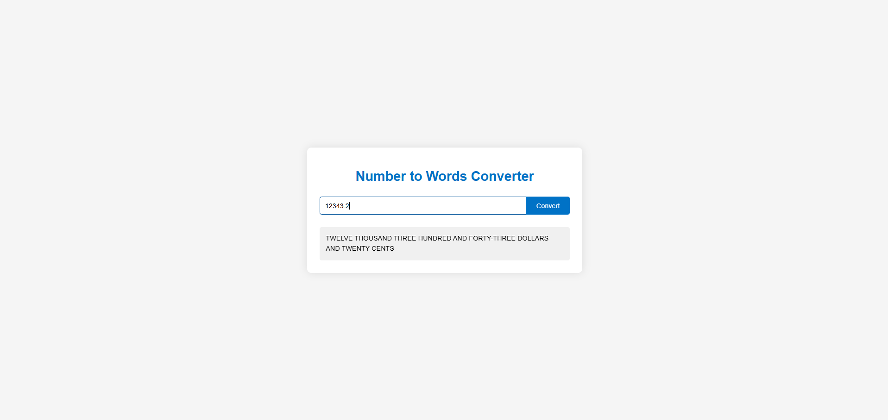
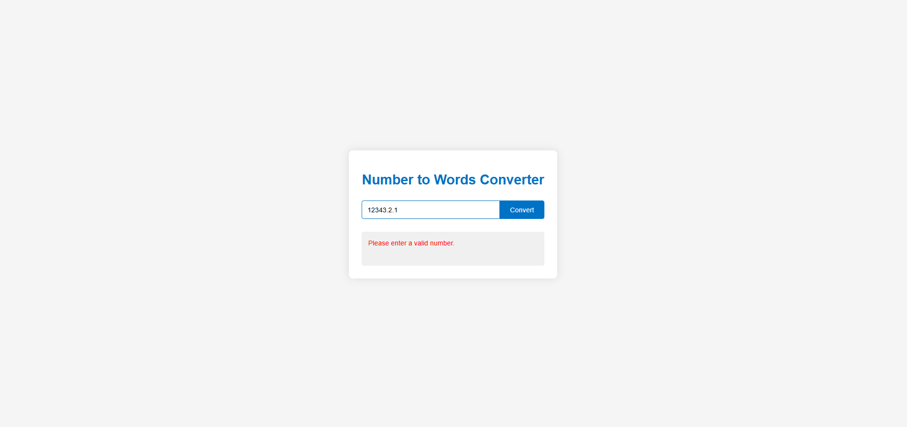

# Number to Words Converter

This is a small .NET 8.0 web application I built for a TechOne coding task. It takes a number and converts it into words, using a C# Web API on the backend and a simple HTML/CSS/JavaScript frontend.

## About This App

When you type a number into the form and click “Convert,” the page sends it to the /api/convert endpoint. The backend validates the input, runs it through a number-to-words service, and returns the result in plain English. The page updates instantly with the conversion.

## Technologies Used

- **Backend:** .NET 8.0, ASP.NET Core Web API (C#)
- **Frontend:** HTML, CSS, JavaScript
- **Tooling & Runtime:** `dotnet run`for local dev, with controllers, services, and static files all in the same project

---

## Highlights & My Contributions

- **Full-stack implementation**
  - Structured `wwwroot/` with static assets, and routed backend via controllers.
- **Backend logic**
  - Created `NumberToWordsConverter.cs` as a reusable service.
  - Implemented `ConvertController` to expose `/api/convert`, handling user input and conversion.
- **Frontend integration**
  - Built `index.html` with a form and result display.
  - Wrote `scripts.js` to submit the form with Fetch API, dynamically using relative URLs for flexibility across ports.
- **Dev setup improvements**
  - Added `.UseDefaultFiles()`, `.UseStaticFiles()`, and `.MapControllers()` for seamless local hosting.
  - Ensured compatibility across dynamically assigned ports and removed hardcoded URLs.

---

## Challenges Faced

- **Port mismatch:** Initially hard-coded to localhost:5000, which broke when the runtime picked a different port.
- **AV protection issues:** The AV flagged the build output as suspicious — fixed by disabling the app host in .csproj.
- **Caching confusion:** Browser kept serving an old copy of scripts.js until I added cache-busting and cleared storage.
- **Naming mismatch:** HTML and JS used different IDs for the form, leading to null reference errors.

---

## Key Learnings

- Learned how to structure an ASP.NET Core app to run both static files and API endpoints in one project.
- Got more comfortable with dependency injection and reusable services in C#.
- Improved handling of client–server communication with Fetch API and better error handling.
- Learned to debug environment and security-related issues like antivirus interference and caching.

---

## Screenshots





---

## How to Run Locally

1. Clone the repository.
2. Open a terminal in the project root.
3. Run:
   ```bash
   dotnet run
